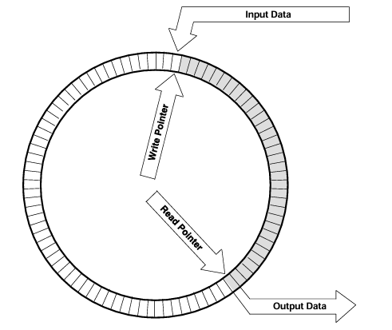
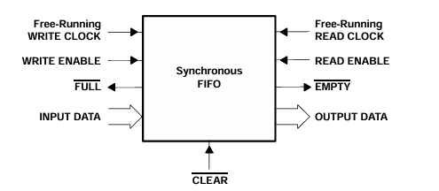

# Synchronous FIFO

A parameterized Synchronous First-In First-Out (FIFO) buffer implemented in Verilog, featuring overflow/underflow protection and full/empty status flags.

## Overview

A FIFO (First-In First-Out) is a queue-style memory buffer where data is written and read in order. This implementation uses a **circular buffer** approach — the write and read pointers both advance through memory slots in a ring, wrapping around when they reach the end.

Data enters at the top and exits at the bottom. The **Write Pointer** tracks where the next write goes; the **Read Pointer** tracks where the next read comes from. Both pointers chase each other around the ring.

## Interface

| Port | Direction | Description |
|------|-----------|-------------|
| `clk` | Input | System clock |
| `rst_n` | Input | Active-low synchronous reset |
| `w_en` | Input | Write enable |
| `r_en` | Input | Read enable |
| `data_in [DATA_WIDTH-1:0]` | Input | Data to write into FIFO |
| `data_out [DATA_WIDTH-1:0]` | Output | Data read from FIFO |
| `fifo_full` | Output | Asserted when FIFO is full (write blocked) |
| `fifo_empty` | Output | Asserted when FIFO is empty (read blocked) |
| `fifo_overflow_flag` | Output | Latched flag: write attempted while full |
| `fifo_underflow_flag` | Output | Latched flag: read attempted while empty |

## Architecture

### High-Level Block Diagram

The top-level module `Synchronous_FIFO` is composed of four sub-modules:

| Sub-module | Role |
|------------|------|
| `write` | Manages the write pointer and generates `fifo_w_en` |
| `read` | Manages the read pointer and generates `fifo_r_en` |
| `state` | Computes full/empty flags and overflow/underflow flags |
| `array` | The actual memory array; performs read/write using pointer indices |

## Waveform

Key behaviors visible in the waveform:

- **Reset phase**: `rst_n` deasserts → `fifo_empty` goes high; `fifo_underflow_flag` pulses because `r_en` was high during reset when FIFO was empty.
- **Normal writes**: `w_en` toggles; data (`6c`, `8a`, `44`, ...) is written each cycle `w_en = 1`.
- **Normal reads**: `r_en` asserted → `data_out` produces data in write order (`6c`, `8a`, `44`).
- **FIFO full**: After many writes, `fifo_full` asserts and `fifo_overflow_flag` latches high when write is still attempted.
- **Drain reads**: Later `r_en` bursts read out `72`, `14`, `7b` in order, confirming FIFO ordering.

### Low-Level Sub-modules

#### Write Module

**Inputs:** `clk`, `rst_n`, `w_en`, `fifo_full`  
**Outputs:** `w_ptr [PTR_WIDTH:0]`, `fifo_w_en`

- `fifo_w_en` is only asserted when `w_en = 1` AND `fifo_full = 0` (write gate).
- On each enabled clock edge, `w_ptr` increments by 1.
- On reset, `w_ptr` returns to 0.
- The pointer is `PTR_WIDTH+1` bits wide — the extra MSB is used by the State module to distinguish full vs. empty when the lower bits match.

#### Read Module

**Inputs:** `clk`, `rst_n`, `r_en`, `fifo_empty`  
**Outputs:** `r_ptr [PTR_WIDTH:0]`, `fifo_r_en`

- `fifo_r_en` is only asserted when `r_en = 1` AND `fifo_empty = 0` (read gate).
- On each enabled clock edge, `r_ptr` increments by 1.
- On reset, `r_ptr` returns to 0.
- Same pointer width as `w_ptr` for MSB-based full/empty detection.

#### State Module

**Inputs:** `clk`, `rst_n`, `w_en`, `r_en`, `w_ptr [PTR_WIDTH:0]`, `r_ptr [PTR_WIDTH:0]`  
**Outputs:** `fifo_full`, `fifo_empty`, `fifo_overflow_flag`, `fifo_underflow_flag`

This module computes FIFO status by comparing the write and read pointers:

| Condition | Meaning |
|-----------|---------|
| `w_ptr[PTR_WIDTH-1:0] == r_ptr[PTR_WIDTH-1:0]` AND `w_ptr[PTR_WIDTH] == r_ptr[PTR_WIDTH]` | **FIFO Empty** |
| `w_ptr[PTR_WIDTH-1:0] == r_ptr[PTR_WIDTH-1:0]` AND `w_ptr[PTR_WIDTH] != r_ptr[PTR_WIDTH]` | **FIFO Full** |

- **`fifo_overflow_flag`**: Latched high when a write is attempted while `fifo_full` is asserted. Cleared on reset.
- **`fifo_underflow_flag`**: Latched high when a read is attempted while `fifo_empty` is asserted. Cleared on reset.

#### Array Module

**Inputs:** `clk`, `data_in`, `fifo_r_en`, `fifo_w_en`, `w_ptr [PTR_WIDTH:0]`, `r_ptr [PTR_WIDTH:0]`  
**Outputs:** `data_out [DATA_WIDTH-1:0]`

- Internally holds a `DEPTH × DATA_WIDTH` register array.
- **Write**: On rising clock edge, if `fifo_w_en`, write `data_in` to `mem[w_ptr[PTR_WIDTH-1:0]]`.
- **Read**: `data_out` is driven combinatorially from `mem[r_ptr[PTR_WIDTH-1:0]]` when `fifo_r_en` is asserted; registered on the clock edge.

---
*2026 — Hồ Huỳnh Anh Thy*
